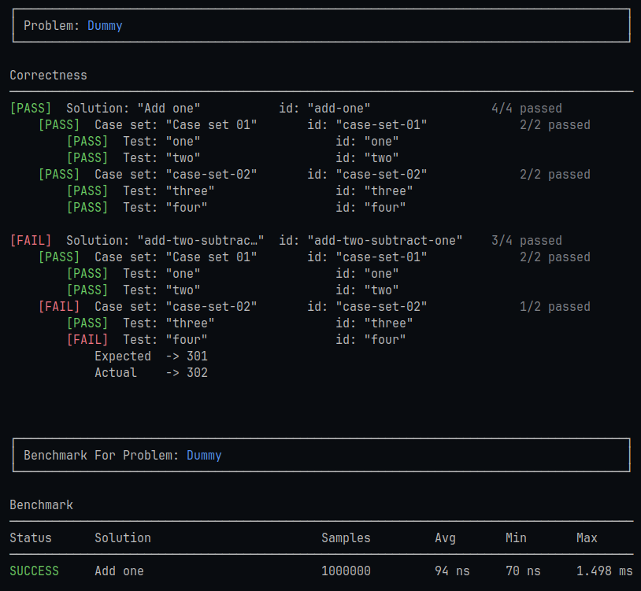

# **Java Problem Benchmark**

---
This is a personal project. i'm trying to figure out what it would look like to define coding problems the way you'd write them on LeetCode.

There are contract, case sets and solutions but in plain Java classes instead of scattering logic across a bunch of test files.

It's not a finished library. it's closer to a framework experiment actually, because of annotation-driven problem definitions, a correctness-first runner, a basic benchmark pass, and some console output so I can actually see what the hell happened.

Requires:

- Java 21
- Maven

---
## Why I'm building this

When i'm working through algorithm problems i usually end up with one solution method and a test class that grows over time. That works, but it gets messy fast, especially when i want to try a second approach, or a third, and compare them against the same inputs.

So i started sketching a model where a problem is just a class:

- `@Contract` says what the test cases and solutions arguments signature should look like
- `@CaseSet` groups related test cases together
- `@Solution` marks the implementations you want to run

The runner validates that everything lines up, executes each solution against every case, benchmarks the ones that pass, and tells you what happened.

---
## Where things stand

Right now it does correctness checking and a simple timing benchmark.

Correctness runs first. only solutions that pass every test case get benchmarked. if nothing passes, benchmark is skipped with a reason.

If you want more details like validation rules, the full pipeline and ..., it's all in [flow.md](docs/flow.md).

I kept the README short on purpose.

---
## Try it

There's a dummy problem in the test suite and a real `TwoSumProblem` in `Main`. both run correctness + benchmark and print the results.

Use:

```bash
mvn test
```

Or run `Main` directly:

```bash
mvn compile && java -cp target/classes org.example.jpb.Main
```

---
## What a problem looks like

Like this:

```java
@Problem(id = "problem-dummy", displayName = "Dummy")
static class DummyProblem {

    @Contract
    static final ProblemContract contract = ProblemContract.accepts(Integer.class).expects(Integer.class);

    @CaseSet(id = "case-set-01", displayName = "Case set 01")
    public List<TestCase> cases() {
        return List.of(
                TestCase.of("one", Arguments.single(1), 2),
                TestCase.of("two", Arguments.single(2), 3)
        );
    }

    @CaseSet(id = "case-set-02")
    public List<TestCase> cases2 = List.of(
            TestCase.of("three", Arguments.single(150), 151),
            TestCase.of("four", Arguments.single(300), 301)
    );

    @Solution(id = "add-one", displayName = "Add one")
    public Integer addOne(Integer input) {
        return input + 1;
    }

    @Solution(id = "add-two-subtract-one")
    public Integer addTwoSubOne(Integer input) {
        if (input == 300) return input + 2;
      
        return input + 2 - 1;
    }
}
```

And to run it yourself:

```java
BenchmarkConfig benchmarkConfig = BenchmarkConfig.builder()
        .warmupIterations(10_000)
        .measurementIterations(100_000)
        .build();

ProblemExecutor executor = new ProblemExecutor();
ProblemExecutionResult result = executor.execute(DummyProblem.class, benchmarkConfig);

ConsoleRenderOptions options = ConsoleRenderOptions.builder()
        .showIds(true)
        .showPassedCaseSets(false)
        .showPassedTestCases(false)
        .showBenchmark(true)
        .build();

ProblemConsoleRenderer renderer = new ProblemConsoleRenderer();
renderer.renderProblemResult(result.getProblemResult(), options);
renderer.renderBenchmarkResult(result.getProblemBenchmarkResult(), options);
```

And here you can see the current output:



A case set can be declared on a field or a no-argument method. you can attach multiple `@Solution` methods and the runner will hit all of them. every `@Problem`, `@CaseSet`, `@Solution` annotations and `TestCase` class needs an `id`. `displayName` is optional and falls back to `id` when you leave it blank.

Signatures get checked against the contract before anything runs. if something doesn't match, it fails early with a message that actually tells you what went wrong.

---
## What's in the repo

```
src/main/java/org/example/jpb/
  annotation/       markers: @Problem, @Contract, @CaseSet, @Solution, @Generator
  core/
    benchmark/      BenchmarkRunner
    constants/      ModelLimits
    enums/          BenchmarkStatus
    model/          contracts, prepared artifacts, result models, BenchmarkConfig
    runner/         ProblemPreparator, ProblemRunner, ProblemExecutor
  problems/         TwoSumProblem (example)
  render/
    console/        ProblemConsoleRenderer
    constants/      ConsoleLayout
    model/          ConsoleRenderOptions
  util/             Console, ModelChecks, ReflectionExecutor, ResultComparator
```

`Main.java` runs `TwoSumProblem` through the full pipeline and prints correctness + benchmark output.

No CLI yet. (is it really required tho?)

---
## Roadmap

Stuff that's working and i'm happy with:

- [x] Annotation-based problem definitions
- [x] `@Contract` with a small fluent builder (`accepts` / `expects`)
- [x] `@CaseSet` on methods and fields, single case or a list
- [x] `@Solution` — run multiple implementations against the same cases
- [x] Stable `id` + optional `displayName` on problems, case sets, solutions, and test cases
- [x] Contract validation before execution
- [x] `ResultComparator` that handles arrays and the usual equality cases
- [x] Console renderer with pass/fail output and benchmark table
- [x] Basic benchmarking: warmup, measurement iterations, min/avg/max timing
- [x] `ProblemExecutor` that runs correctness first, then benchmarks passing solutions

Stuff i still need to do:

- [ ] Improve benchmark reliability:
  - [ ] Batch timing
  - [ ] Result sink / dead-code-elimination protection
  - [ ] Better sample statistics
  - [ ] Mutable input isolation
  - [ ] Benchmark environment metadata
  - [ ] JMH integration or export
- [ ] `@Generator` — random case generation at runtime
- [ ] Discovery and loading pipeline for `@Problem` classes:
    - [ ] Load compiled classes from `.class` files
    - [ ] Load problems from external `.jar` files
    - [ ] Support raw `.java` source files via compilation + loading


## Notes

This is a learning project first.

The API and implementation will change while learn what is useful, safe, and maintainable.

For the architectural details, go read [flow.md](docs/flow.md).
